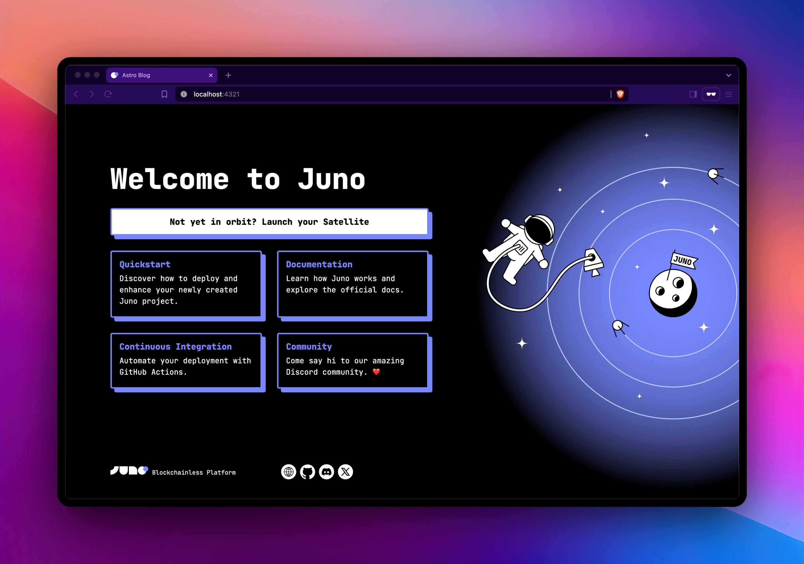

# Juno: Astro Starter Kit

```sh
npm create juno@latest -- --template astro
```

> 🧑‍🚀 **Seasoned dev?** Delete this file. Have fun!



A starter kit developer for [Juno](https://juno.build) using [Astro](https://docs.astro.build).

## ✨ Links & Resources

- Looking to get started with Juno? Check out the [documentation](https://juno.build).
- Have a look at the [Astro](https://docs.astro.build) for question regarding the templates.
- Have questions, comments or feedback? [Join our discord](https://discord.gg/wHZ57Z2RAG) or [OpenChat](https://oc.app/community/vxgpi-nqaaa-aaaar-ar4lq-cai/?ref=xanzv-uaaaa-aaaaf-aneba-cai).

## 🧞 Commands

All commands are run from the root of the project, from a terminal:

| Command          | Action                                      |
|:-----------------|:--------------------------------------------|
| `npm install`    | Installs dependencies                       |
| `npm run dev`    | Starts local dev server at `localhost:4321` |
| `npm run build`  | Build your production site to `./dist/`     |
| `juno deploy`    | Deploy your project to a Satellite          |

## 🚀 Launch

Explore this [guide](https://juno.build/docs/add-juno-to-an-app/create-a-satellite) to launch your Satellite into orbit via Juno's [administration console](https://console.juno.build).
